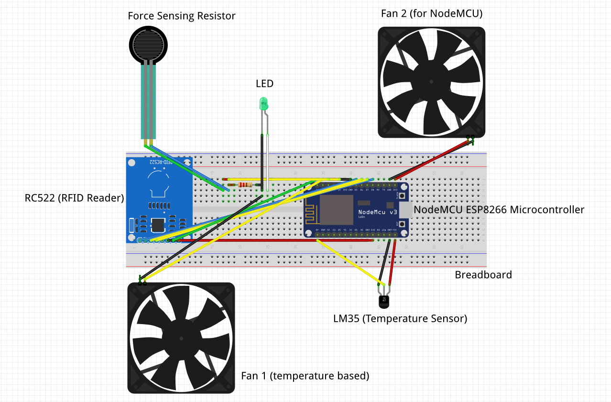

# tag-bag
4th Semester MPCA (UE20CS252) Final Project attempting to enhance a simple bag by performing a few basic but helpful functions to aid the user with the help of a NodeMCU ESP8266MOD. 

**Team Members**
1) [Atharv Tiwari](https://github.com/atharvtiwari)
2) [Manas Chebrolu](https://github.com/manasch)
3) [Aryan Karn](https://github.com/aryankarn)

## Circuit Diagram

